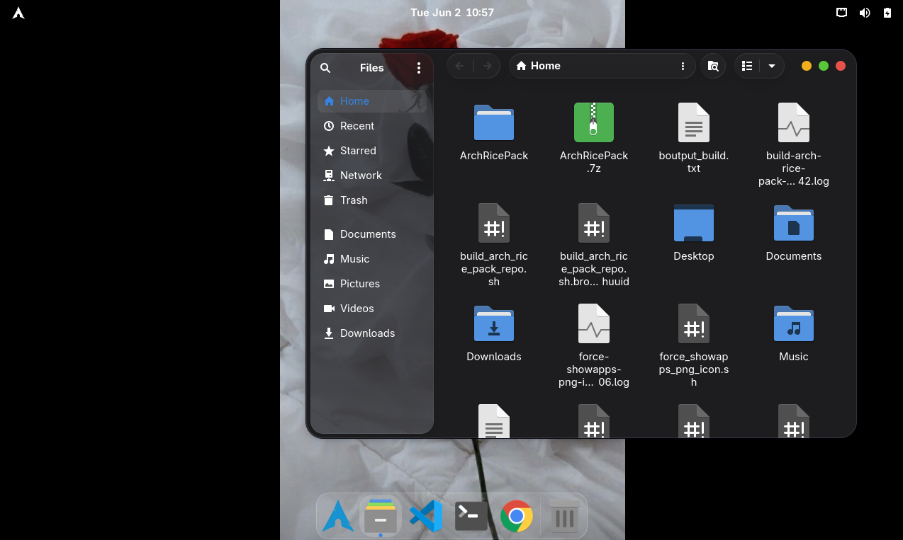
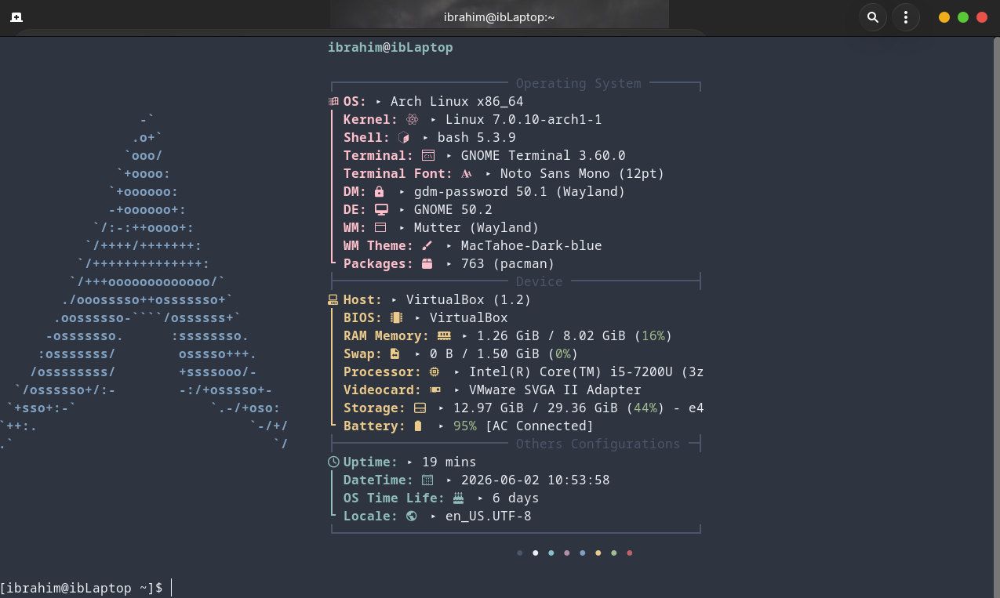

<h1 align="center">Arch Linux With MacOS Theme</h1>

<p align="center">
  <strong>A portable post-install rice pack for Arch Linux with GNOME and MacTahoe-style theming</strong>
</p>




## Table of Contents

- [Overview](#overview)
- [Features](#features)
- [Prerequisites](#prerequisites)
- [Installation](#installation)
- [Project Structure](#project-structure)
- [Script Overview](#script-overview)
- [Customization](#customization)
- [Troubleshooting](#troubleshooting)
- [Credits](#credits)

## Overview

This repository provides an automated setup for a beautiful macOS-inspired Arch Linux desktop environment with GNOME Shell. It installs curated packages, applies custom themes, configures extensions, and sets up modern terminal tools.

**⚠️ Important:** This rice pack is designed to be run **after** a clean Arch Linux installation, ideally during the `arch-chroot` phase or immediately after first boot as a regular user.

## Features

### Desktop Environment
- **GNOME Shell** with MacTahoe-Dark-blue theme for a macOS aesthetic
- **Dash-to-Dock** bottom dock with reveal-on-hover behavior
- **Hide Top Bar** extension for minimal distraction
- **Papirus/Rice-Papirus** icon theme
- **Dynamic wallpaper rotation** (5-second intervals from `assets/wallpapers/`)

### Applications & Tools
- Google Chrome from AUR
- Visual Studio Code (`visual-studio-code-bin`)
- Nautilus context menu integration for opening with Code
- Power mode switching via `power-profiles-daemon`

### Terminal & CLI Tools
- Blue Arch Fastfetch startup banner
- Modern command-line replacements: `eza`, `bat`, `btop`, `fd`, `ripgrep`, `fzf`, `zoxide`, `jq`, `tree`, `ncdu`, `tldr`, `chafa`

### Keybindings
| Keys | Action |
|------|--------|
| `Super` | GNOME overview (Mutter overlay) |
| `Super+A` | Applications grid |
| `Super+S` / `Super+Tab` | Overview/search |
| `Ctrl+Alt+T` | Terminal |
| `Ctrl+Shift+Esc` | System monitor |
| `Super+E` | Files (Nautilus) |
| `Super+C` | VS Code |
| `Super+B` | Browser |

### Boot & Login Screens
- Custom GRUB background (`assets/bg.png`)
- Custom GDM/login background (`assets/ib.png`)

## Prerequisites

Before running this installer, ensure:

- ✅ **Fresh Arch Linux installation** with GNOME 47+ (or current version)
- ✅ **Internet connection** (packages are downloaded from official repos and AUR)
- ✅ **User account** created during initial setup (run as regular user, not root)
- ✅ **Base system** with `base-devel`, `git`, and `base` group installed
- ✅ AUR helper like `yay` or `paru` (installer can install `yay` if missing)
- ✅ **At least 8-10 GB free disk space** for packages and assets

### Recommended Initial Setup
```bash
# During arch-chroot phase
pacstrap /mnt base base-devel linux linux-firmware
# Install essential packages
pacstrap /mnt grub efibootmgr networkmanager gnome gnome-extra
systemctl enable NetworkManager --root=/mnt
# ... complete initial arch-chroot setup ...
```

### Quick Start

1. **Clone the repository** to your home directory:
   ```bash
   cd ~
   git clone https://github.com/ib-hussain/ArchRicePack
   cd ArchRicePack
   ```

2. **Make scripts executable:**
   ```bash
   chmod +x install-rice.sh scripts/*.sh
   ```

3. **Run the installer** (captures output to log file):
   ```bash
   ./install-rice.sh | tee install-output.txt
   ```
   The installer runs interactively and may prompt for your sudo password.

4. **Log out and back in:**
   ```bash
   gnome-session-quit --logout --no-prompt
   ```
   Or use the GNOME power menu: press Super key and select the power icon.

5. **Reboot (recommended):**
   ```bash
   sudo reboot
   ```

### Optional: Custom Assets

To use custom wallpapers and boot/login screens, provide these files:

```
assets/bg.png   → GRUB boot screen background (→ /boot/grub/bg.png)
assets/ib.png   → GDM/GNOME login screen background (→ /usr/share/backgrounds/rice/ib.png)
```

If missing, the installer skips these steps gracefully.

## Project Structure

```
ArchRicePack/
├── install-rice.sh           # Main installation script entry point
├── scripts/                  # Individual installation phase scripts
│   ├── 00-common.sh         # Shared utilities and functions
│   ├── 01-install-packages.sh
│   ├── 02-restore-themes-and-configs.sh
│   ├── 03-setup-terminal.sh
│   ├── 04-setup-extensions.sh
│   ├── 05-apply-gnome-settings.sh
│   ├── 06-setup-nautilus-code.sh
│   ├── 07-setup-assets-grub-gdm-wallpaper.sh
│   └── 08-finalize-and-verify.sh
├── assets/                   # Themes, configs, wallpapers, and backgrounds
│   ├── vscode/              # VS Code extensions and user settings
│   ├── wallpapers/          # Dynamic wallpaper rotation
│   ├── themes/              # GTK and GNOME Shell themes
│   ├── icons/               # Icon theme collections
│   ├── configs/             # Configuration files for various apps
│   └── [bg.png, ib.png]     # Optional custom boot/login backgrounds
├── packages/                 # Package lists
│   ├── pacman-packages.txt
│   ├── aur-packages.txt
│   └── [*-core.txt]         # Core dependency lists
└── docs/                     # Documentation and images
```

## Script Overview

| Script | Purpose |
|--------|---------|
| `00-common.sh` | Defines shared variables and helper functions (sourced by others) |
| `01-install-packages.sh` | Installs pacman and AUR packages; ensures `yay` is available |
| `02-restore-themes-and-configs.sh` | Applies themes, icons, and custom dconf settings |
| `03-setup-terminal.sh` | Configures bash, bashrc, and installs modern CLI tools |
| `04-setup-extensions.sh` | Installs and enables GNOME Shell extensions |
| `05-apply-gnome-settings.sh` | Sets keybindings, favorite apps, overlay key, and other GNOME tweaks |
| `06-setup-nautilus-code.sh` | Installs nautilus-python extensions for context menu integration |
| `07-setup-assets-grub-gdm-wallpaper.sh` | Copies wallpapers and custom boot/login backgrounds |
| `08-finalize-and-verify.sh` | Verification step; generates system state report |

## Customization

### Modify Installed Packages
Edit the package lists before running the installer:
- `packages/pacman-packages.txt` – Official repo packages
- `packages/aur-packages.txt` – AUR packages

### Change Theme Colors
The main theme is **MacTahoe-Dark-blue**. To use a variant:
1. Edit `configs/dconf/dconf-complete.ini`
2. Change theme references to available MacTahoe variants (e.g., `-hdpi`, `-xhdpi`)
3. Rebuild and apply dconf settings

### Add Custom Keybindings
Edit `configs/dconf/media-keys.ini` to customize shortcuts before installation.

### Disable Wallpaper Rotation
Remove or rename `configs/autostart/ib-wallpaper-rotator.desktop` to disable dynamic wallpapers.

## Troubleshooting

### Installation Hangs or Fails
- Check your internet connection
- Ensure `yay` or `paru` is installed (installer attempts to install it)
- Review the output log: `install-output.txt`
- Run individual scripts manually from `scripts/` if needed

### GNOME Extensions Not Loading
```bash
# Restart GNOME Shell
Alt+F2, type: r, press Enter

# Or fully restart the session
gnome-session-quit --logout --no-prompt
```

### Theme Not Applied
```bash
# Manually apply theme via dconf
dconf load / < configs/dconf/dconf-complete.ini

# Restart GNOME Shell
Alt+F2, type: r, press Enter
```

### Missing Font or Icon Issues
```bash
# Reinstall theme and icon packages
sudo pacman -S papirus-icon-theme
# Then reapply settings
./scripts/02-restore-themes-and-configs.sh
```

### Wallpaper Rotation Not Working
- Ensure `assets/wallpapers/` directory contains image files
- Check that `ib-wallpaper-rotator.desktop` is in `~/.config/autostart/`
- Verify rotation script has execute permissions

## Credits

This project is inspired by and adapted from:

- [Arch Linux with macOS Tahoe theme](https://www.reddit.com/r/unixporn/comments/1pyuj21/gnome_my_arch_linux_with_macos_tahoe_theme/) on r/unixporn
- [MacOS Tahoe GTK Theme](https://github.com/vinceliuice/MacTahoe-gtk-theme) by vinceliuice
- [MacOS Tahoe Icon Theme](https://github.com/vinceliuice/MacTahoe-icon-theme) by vinceliuice
- [Fastfetch Configuration](https://github.com/Vapor55/My-Fastfetch-Dotfiles) by Vapor55
- [Noto Sans Font](https://fonts.google.com/noto/specimen/Noto+Sans) by Google
- [Papirus Icon Theme](https://github.com/PapirusDevelopmentTeam/papirus-icon-theme)

### Enhancements in This Fork
- Dynamic wallpaper rotation (5-second intervals)
- Pre-configured VS Code extensions and keybindings
- Automated nautilus-python integrations
- Streamlined post-install scripts with logging